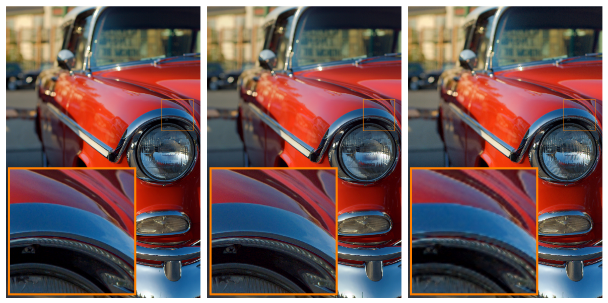

# Production-Ready Deep Enhancement of Full-Resolution Images

## Setup

1. Clone the repository:

```
git clone https://github.com/pr-defr/enhancement.git
```

2. Install the dependencies:

```
pip install -r requirements.txt
```

## Usage

This repository provides 2 pretrained models:

**enhancer.pt:** An enhancer network based on the BiHead U-Net

**upscaler.pt:** An upscaler network based on the Deep Joint Upsampler optimized for upscaling 6 times the input

The included scripts will process the input image at a given resolution and compute the result at the original resolution.

* Use `python enhance-rmu.py` to enhance an image and upscale it to the main resolution with the Residual Mask Upscaling technique.

* Use `python enhance-dju.py` to enhance an image and upscale it to the main resolution with the Deep Joint Upsampling network.

Both scripts include default parameters that you can modify to fit your needs. Inference can be done in cpu or gpu.
When running the script it will enhance a sample image from the `examples/` folder and store it in the `out/` folder.
It will also show at what resolution the *enhancer* network is processing the image.

For instance, run `enhance-rmu.py` with the defaults:

```
>>> python enhance-rmu.py
Running inference at 680x1024 pixels
Storing result at out/rmu-4663.jpg
```

You will have the result image at `out/rmu-4663.jpg`. Now you can run `enhance-dju.py` with the defaults:

```
>>> python enhance-dju.py
Running inference at 334x502 pixels
Storing result at out/dju-4663.jpg
```

You will see that inference resolution is different since the upscaling network is optimized to upscale 6 times the input.
You can then select that same resolution with the `enhance-rmu.py` to have a comparison:

```
>>> python enhance-rmu.py --i_resolution 502 --out out/rmu-4663-at-502px.jpg
Running inference at 334x502 pixels
Storing result at out/rmu-4663-at-502px.jpg
```

You should expect outputs to look similar to the following example:



From left to right: RMU at 1362x2048px, DJU at 334x502px, RMU at 334x502px.

## Data

Find included some samples from the [**MIT-Adobe FiveK**](https://data.csail.mit.edu/graphics/fivek/) dataset in the `examples/` folder. They are from editor **C** and converted to jpg with included Lihgtoom Catalog 